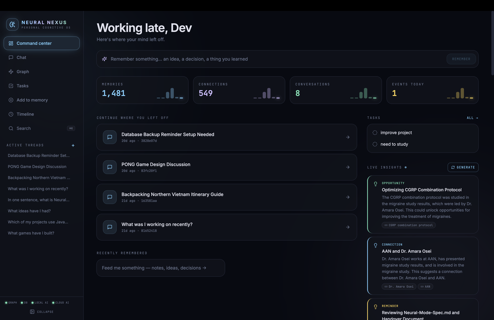
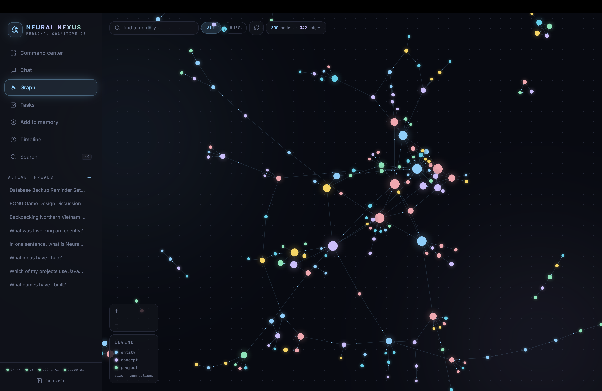
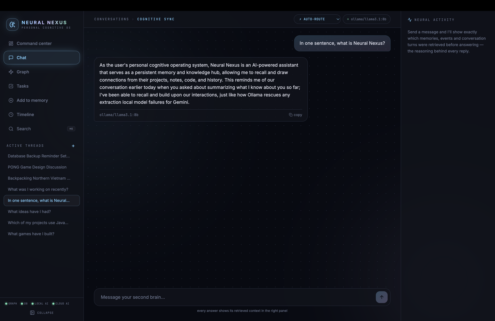

# Neural Nexus

**A local-first cognitive operating system with permanent, structured memory.**

Neural Nexus parses your notes, files, project folders, and conversation history into a temporal knowledge graph, then retrieves the relevant context before every response. Memory is the core primitive — the underlying language model is a swappable component.

[](LICENSE)
[](https://www.python.org/)
[](https://nodejs.org/)
[](https://fastapi.tiangolo.com/)
[](https://react.dev/)



---

## Table of Contents

- [Overview](#overview)
- [Key Features](#key-features)
- [Screenshots](#screenshots)
- [Architecture](#architecture)
- [Technology Stack](#technology-stack)
- [Quick Start](#quick-start)
- [Feeding the Graph](#feeding-the-graph)
- [Project Structure](#project-structure)
- [Documentation](#documentation)
- [Roadmap](#roadmap)
- [License](#license)

---

## Overview

Most AI assistants start every conversation from zero. Neural Nexus is built around the opposite assumption: that context accumulated over time — your projects, code, research, and past conversations — is the most valuable input to any assistant, and that it should persist, be queryable, and be inspectable rather than hidden inside a prompt.

Under the hood, ingested content is parsed into a **temporal knowledge graph** of entities and relationships, each tagged with when it was true. Every chat message triggers a hybrid graph and semantic retrieval step before the model responds, and the retrieved context is surfaced in the UI rather than kept opaque.

Neural Nexus is single-user, local-first, and designed to run entirely on your own machine, with cloud model calls as an optional, swappable component rather than a requirement.

## Key Features

- **Persistent, structured memory.** Notes, files, PDFs, project folders, and exported ChatGPT/Claude conversation history are parsed into a temporal knowledge graph of entities, relationships, and timestamps.
- **Transparent retrieval.** Every chat message triggers hybrid graph + semantic search before the model responds. The Neural Activity panel shows exactly what was retrieved.
- **Daily insight generation.** An Insight Engine walks the graph on a schedule and surfaces connections, opportunities, and reminders, which can be pinned or dismissed from the Command Center.
- **Visual graph exploration.** A force-directed graph view renders nodes sized by connectivity and animated particles along relationships. Clicking a node inspects its facts or opens it in chat.
- **Multi-model routing.** An AI Router dispatches tasks to cloud or local models, with manual override. If cloud quota is exhausted, a local model answers instead and responses are flagged accordingly. Bulk imports default to local inference with cloud fallback for difficult extractions.
- **Explicit forgetting.** Threads and individual memories can be deleted; deleting a memory removes both the episode and its extracted facts from the graph.

## Screenshots


*Command Center — daily insights, activity, and quick actions.*


*Force-directed knowledge graph with live relationship traversal.*


*Chat interface showing retrieved memory context alongside the conversation.*

## Architecture

```
┌────────────────────────────────────────────────────────┐
│  React + TypeScript + Tailwind                          │
│  Command Center · Chat · Living Graph · Ingest Airlock  │
│  · Timeline · ⌘K palette                                │
└───────────────────────────┬────────────────────────────┘
                             │ REST
┌───────────────────────────┴────────────────────────────┐
│                    FastAPI core (5 modules)              │
│  Memory · Knowledge Graph · Context Engine · AI Router   │
│  · Conversation      + plug-ins: Importers, Insights     │
└──────┬──────────────┬──────────────────┬────────────────┘
       │              │                  │
   ┌───┴────┐   ┌─────┴──────┐    ┌──────┴─────────────┐
   │ Neo4j  │   │ PostgreSQL │    │ LiteLLM router      │
   │ graph  │   │ events ·   │    │ Gemini ⇄ Ollama      │
   │(Graphiti)  │ convos ·   │    │ (any provider via    │
   └────────┘   │ insights   │    │  a single .env key)  │
                └────────────┘    └────────────────────┘
```

**Design principles**

- The core stays fixed at five modules; all additional functionality is implemented as a plug-in.
- Only one file interfaces with the graph engine directly, so it can be swapped without touching the rest of the system.
- Every action writes to an append-only event log, which powers the timeline and insight generation.
- Single-user, local-first, no authentication layer, no cloud storage. Data does not leave the machine except as explicit LLM API calls, and even those can be routed entirely through a local model.

## Technology Stack

| Layer | Technology |
|---|---|
| Frontend | React 18, TypeScript, Tailwind v4, react-force-graph, Vite |
| Backend | FastAPI |
| Graph store | Neo4j via Graphiti (temporal knowledge graph) |
| Relational store | PostgreSQL (events, conversations, insights) |
| Model routing | LiteLLM (multi-provider) |
| Local inference | Ollama |

## Quick Start

**Requirements:** Docker Desktop, Python 3.11+, Node 18+, and either a [Gemini API key](https://aistudio.google.com) or [Ollama](https://ollama.com) installed locally (hybrid mode uses both).

```bash
cp .env.example .env        # add GEMINI_API_KEY; Ollama requires no key
docker compose up -d

cd backend
python -m venv .venv && source .venv/bin/activate
pip install -r requirements.txt
cd ..

cd frontend
npm install
cd ..

./scripts/start.sh          # subsequent runs: just this
```

`scripts/start.sh` checks Docker, starts the databases, Ollama, the backend, and the frontend, then opens the app.
`scripts/stop.sh` shuts everything down.
`scripts/backup.sh` snapshots both databases into `backups/`.

## Feeding the Graph

Place source material in `data/imports/` (gitignored — see the README in that directory for details):

- ChatGPT / Claude conversation export archives
- Entire project folders (no README required — manifests, file trees, and commit history are read directly)
- PDFs and other documents

From the app: **Add to memory → Import sources**, then scan, select, and import. Jobs are paced, deduplicated, and resumable — they can be interrupted and re-run without cost.

## Project Structure

```
.
├── backend/          # FastAPI core: memory, graph, context engine, router, conversation
├── frontend/          # React + TypeScript client
├── data/imports/      # Local drop folder for ingestion (gitignored)
├── docs/               # Architecture, dev log, roadmap, images
├── scripts/            # start.sh, stop.sh, backup.sh
└── docker-compose.yml
```

## Documentation

- [`docs/ARCHITECTURE.md`](docs/ARCHITECTURE.md) — full system design
- [`docs/DEVLOG.md`](docs/DEVLOG.md) — build session notes and engineering decisions
- [`docs/ROADMAP.md`](docs/ROADMAP.md) — what was deliberately deferred from v1 and what's planned next

## Roadmap

See [`docs/ROADMAP.md`](docs/ROADMAP.md) for the full list, including MCP server support, an internship assistant module, a study tracker, and voice input.

## License

Licensed under the [MIT License](LICENSE).
